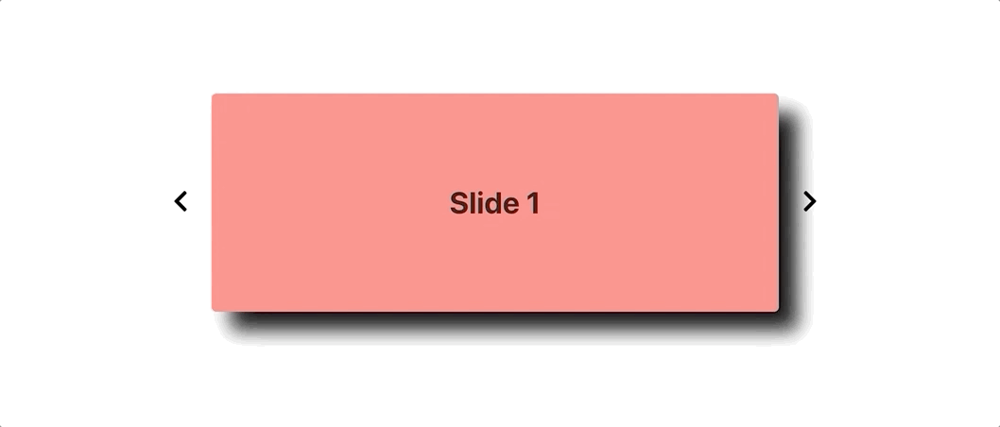

# React Carousel with Transitions

This repo is the corresponding code for this [tutorial](https://levelup.gitconnected.com/adding-transitions-to-a-react-carousel-with-material-ui-b95825653c1b) in which we create a simple React carousel with animations and key control. See the final product deployed [here](https://react-carousel-with-transitions.netlify.app/).

## Installation

1. Clone this repo
2. `npm install`
3. `npm start`
